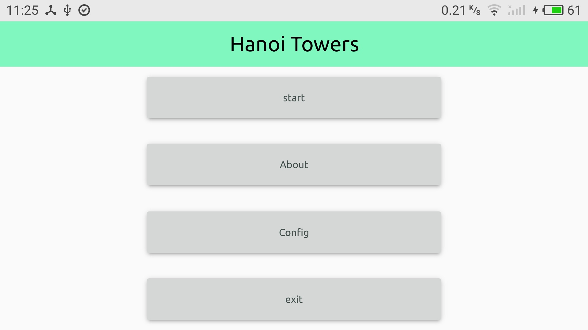
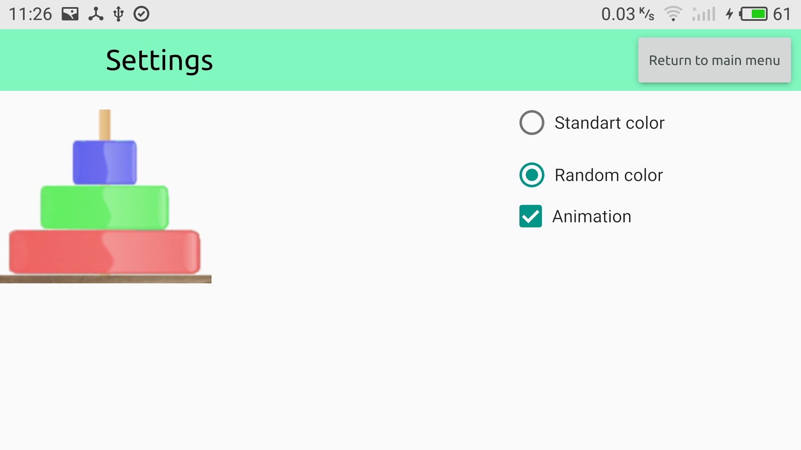
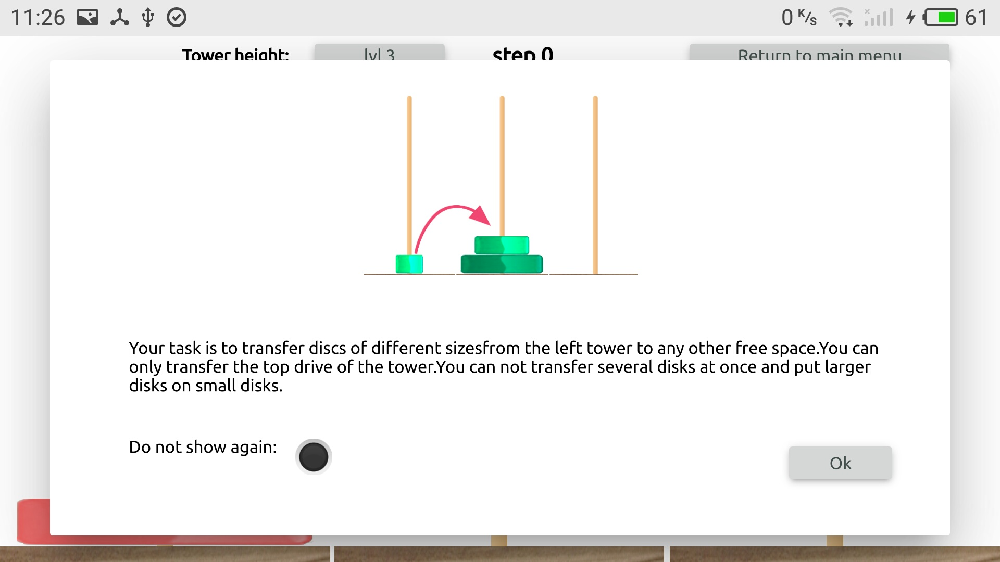
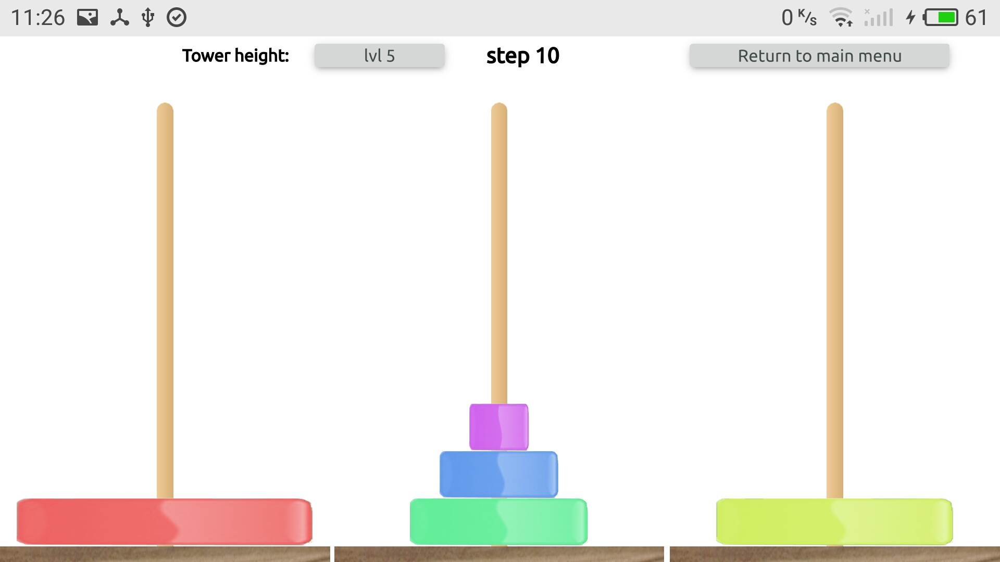

# Hanoi Towers 

# 

***************************
## What is Hanoi Towers

The Hanoi Tower is one of the most popular puzzles of the 19th century. Three bars are given, on one of which eight rings are strung, the rings differ in size and smaller. The problem is to transfer the pyramid from the eight rings for the least number of moves to another rod. At a time, only one ring is allowed to carry, and you can not put a larger ring on less

## Screenshots

## supported platform: 
1. Linux
2. Android 
3. Windows 

## Install 
You can download the latest version of the game [here](https://github.com/EndrII/Hanoi-Towers/releases).

Or download from official services
  * [Android](https://play.google.com/store/apps/details?id=df.mobily.hanoi_towers) 
  * [Ubuntu](https://snapcraft.io/hanoi-tower)
  * Windows - this application has not supported windows store

## Donate
If you want to help the project, then you can donate a small amount to our bitcoin wallet.

### Bitcoin address - 1NJNbDKmezcUcHRfzpBeq2fHeG21oEKX8Q
